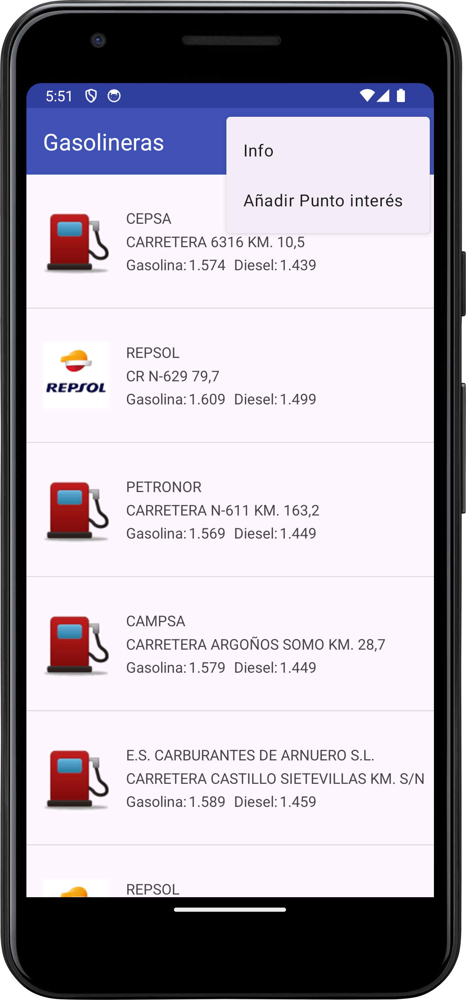
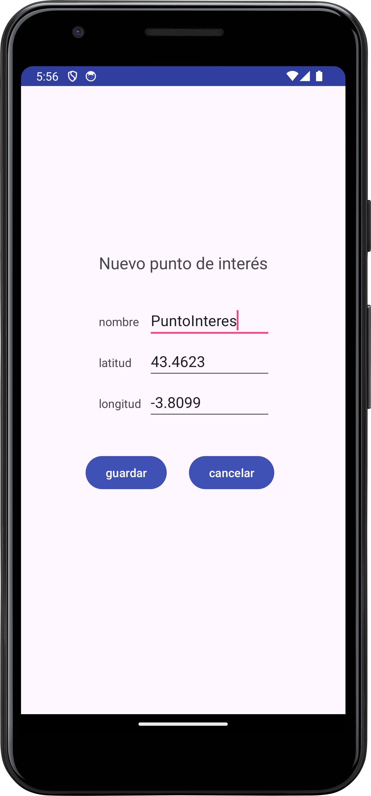
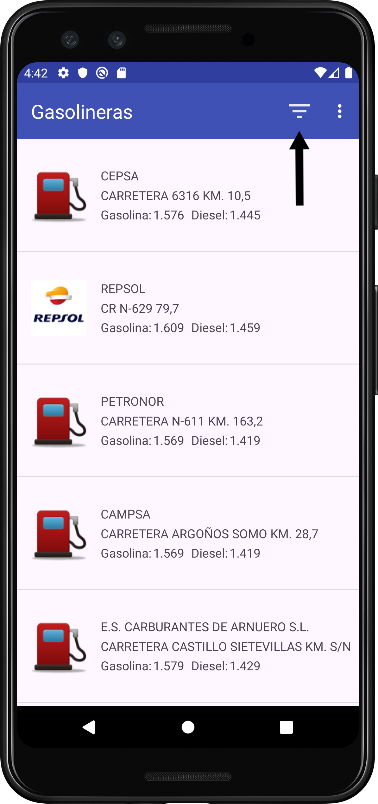
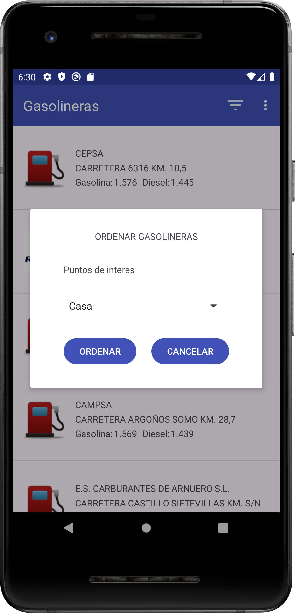
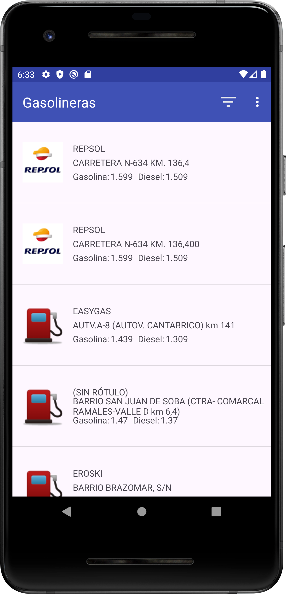
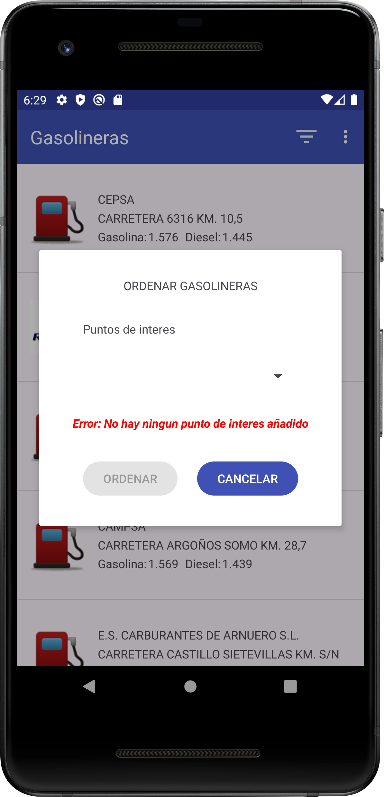
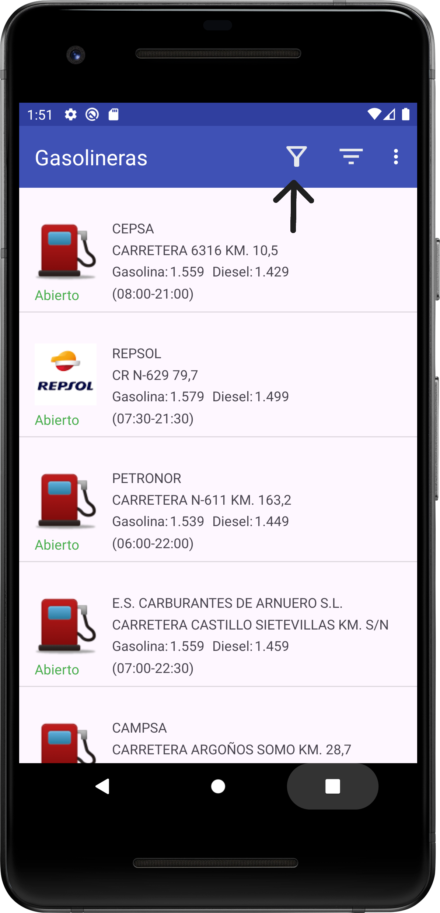
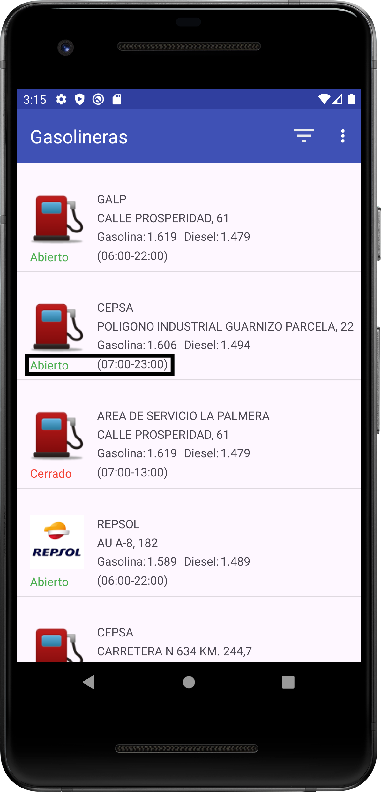
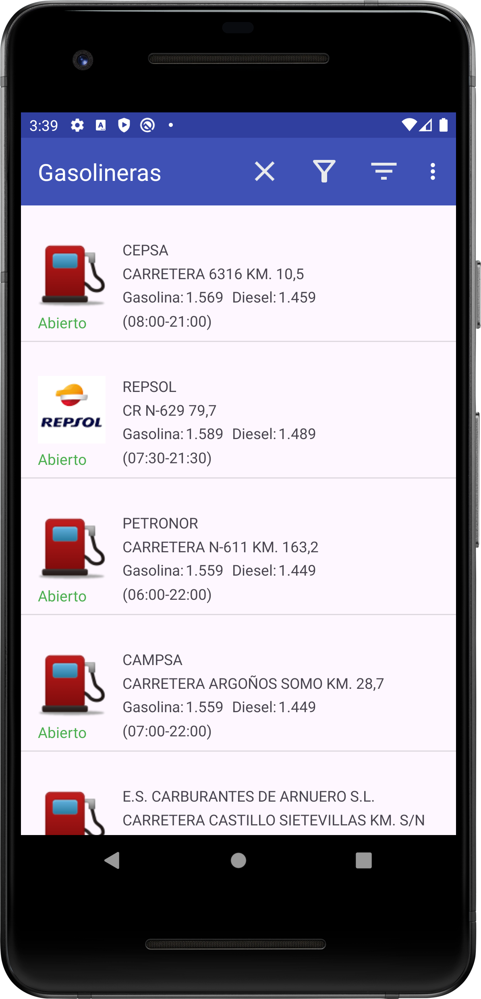
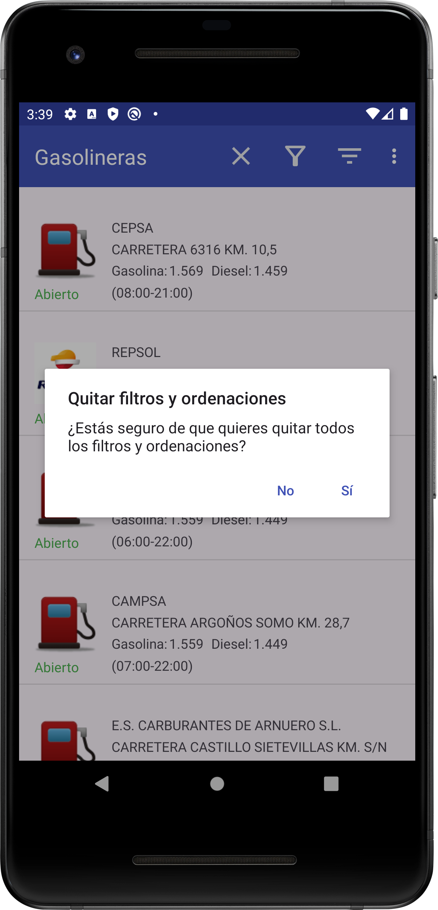

# Manual de uso

## Interacciones de Usuario

### 1. Añadir un Nuevo Punto de Interés

1. El usuario selecciona la opción **Añadir punto de interés** en el menú desplegable.

3. El usuario debe rellenar los siguientes campos:
   - **Nombre**: El nombre del nuevo punto de interés.
   - **Latitud**: La latitud en formato numérico (por ejemplo, `43.4623`).
   - **Longitud**: La longitud en formato numérico (por ejemplo, `-3.8099`).

5. Después de introducir la información, el usuario debe pulsar el botón **Guardar** para almacenar el punto de interés en la base de datos.

6. Si algún campo está vacío o los valores numéricos son incorrectos, el sistema mostrará un mensaje de error:
   - "Por favor, llene todos los campos" si algún campo está vacío.
   - "Por favor, ingresa valores numéricos válidos para latitud y longitud" si los valores no son numéricos.

7. Si ya existe un punto de interés con el mismo nombre, se mostrará un mensaje:
   - "Ya existe un punto de interés con ese nombre".

8. Si todo es correcto, el sistema mostrará un mensaje de éxito:
   - "Punto de interés guardado".
   - A continuación, la vista se cerrará automáticamente.

### 2. Cancelar la Operación

El usuario puede cancelar el proceso en cualquier momento pulsando el botón **Cancelar**, lo cual cerrará la vista sin guardar ningún dato.

## Posibles Errores y Mensajes

- **Por favor, llene todos los campos**: Aparece cuando uno o más campos están vacíos.
- **Por favor, ingresa valores numéricos válidos para latitud y longitud**: Aparece cuando los valores introducidos para latitud o longitud no son numéricos.
- **Ya existe un punto de interés con ese nombre**: Aparece cuando el nombre del punto de interés ya está registrado en la base de datos.
- **Ha ocurrido un error en la base de datos**: Aparece cuando ocurre un error inesperado al acceder a la base de datos.

## Filtros sobre gasolineras

### 1. Ordenar gasolineras mas cercanas a un punto de interes.

1. El usuario pulsa el icono de ordenar gasolineras que aparece en la barra de opciones de la parte superior de la aplicación.

2. Aparece una ventana emergente donde se le muestra al usuario los puntos de interés. Una vez seleccionado pulsa el boton "ORDENAR".
   

3. Se le muestra al usuario la lista de gasolineras ordenada por cercanía al punto de interes solicitado.
   

### 2. Cancelar la Operación

El usuario puede cancelar el proceso en cualquier momento pulsando el botón **Cancelar**, lo cual cerrará la vista sin guardar ningún dato.

## Posibles Errores y Mensajes

1. **Error: No hay ningun punto de interes añadido** En este caso el usuario tendrá que pulsar el botón "CANCELAR" y añadir un punto de interés.
   

## Filtrar por precio de combustible 

### 1. Filtrar por precio máximo de un combustible concreto

1. El usuario pulsa el icono de filtrar que aparece en la barra de opciones de la parte superior de la aplicación.

2. Aparece una ventana emergente donde puedes seleccionar el combustible y escribir el precio máximo pulsando en su campo respectivamente. Una vez que has puesto tus preferencias pulsa el botón **FILTRAR** para filtrar las gasolineras.

3. Si el campo de **PRECIO MAXIMO** está vacio al pulsar **FILTRAR** aparecerá el siguiente mensaje por pantalla:

   - Por favor, introduce un precio máximo.

### 2. Cancelar la Operación

El usuario puede cancelar el proceso en cualquier momento pulsando el botón **CANCELAR**, lo cual cerrará la vista sin guardar ningún dato.

## Posibles Errores y Mensajes

1. **Por favor, introduce un precio máximo**: Aparece cuando el campo **PRECIO MAXIMO** está vacío.

## Novedades de Interfaz

### 1. Horario gasolineras

1. Hemos añadido a la interfaz donde aparecen las listas de las gasolineras el horario que tiene cada una en el dia actual y además mostramos si la gasolinera está abierta o cerrada.

## 1. Quitar filtros y ordenaciones

1. El usuario pulsa el icono de quitar filtros y ordenaciones (icono de "X") de la barra superior.

2. El usuario selecciona **ACEPTAR** para aplicar o **CANCELAR** para retroceder sin cambios.

